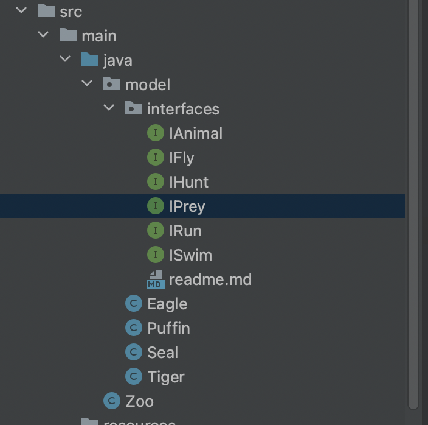

# Interfaces Lab

Copy over `lab_interfaces_start`, and open it in Intellij (don't edit inside of the coursenotes repo, or you'll create merge errors).

You've just inherited a half-written codebase from another developer. It is an app for managing a zoo. In this codebase, it is necessary to have seperate classes for different types of Animals, which you will find in the `models` package. Within that, you will find an interfaces package. This is what it should look like:

But you'll notice it is missing some interfaces, and is also a bit buggy! Some of the interfaces are missing abstract method declarations, some of the classes are missing interface implementations, method declarations, and/or import statements. As a result, our test suite is not passing.

## MVP

 - Add the missing interfaces to the `interfaces` package. 
 - *Implement* the missing interfaces on the problematic classes, as appropriate.
 - Add the appropriate abstract methods to each of the interfaces, if any are missing. This can be determined by context.
 - Pass all tests on `EagleTest`, `SealTest`, `PuffinTest` and `TigerTest`.

## Extensions

- Pass all tests on `ZooTest`.
